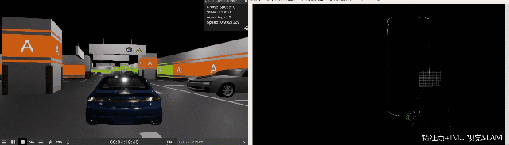

# SUPS: A Simulated Dataset of Underground Parking Scenario for Perception and SLAM Tasks
The repository containing data access and information about the SUPS dataset

## Demo





## Abstract
Automatic underground parking has attracted considerable attention as the scope of autonomous driving expands. The perception tasks of ground signs, vehicles, obstacles, lanes, and parking slots and simultaneous localization and mapping (SLAM) tasks are challenging due to the signal shielding of the Global Navigation Satellite System (GNSS), dim conditions, and ground reflections. Numerous carefully labeled frames are required for the mainstream tasks with well-trained networks and developed SLAM methods. However, few open-source datasets are suitable to support all these tasks for the underground scenario at the same time. In this paper, we intend to cover the defect of existing datasets with the variability of environments and the diversity and accessibility of sensors in the virtual scene. Specifically, we present SUPS, a simulated dataset for underground automatic parking, which supports multiple tasks with multiple sensors. The dataset records frames from four surrounding fisheye cameras, two forward pinhole cameras, a depth camera, and data from LiDAR, inertial measurement unit (IMU), GNSS, and other sensors. Perception, 3D reconstruction, SLAM, and other relative tasks are supported by our dataset. We also evaluate the state-of-the-art SLAM algorithms and perception models on our dataset.

## Content
This dataset contains a changeable virtual scene built based on [LGSVL](https://www.svlsimulator.com/) simulator on Unity, 16 ROS bags, 5k+ BEV images with annotations projected using IPM for example. Following tasks are supported: semantic segmentation, depth estimation, parking slot detection, visual-SLAM, LiDAR based SLAM.

The virtual scene consists of two areas Area A and Area B. Area A occupies 2635 m^2 with the road length of 120 m. Area B occupies 2015 m^2 with 195 m long road. The drivable road in the whole scene is approximately 350 m long, and the parking slot occupies an area of 4650 m^2. There are several different road loops in the scene for providing loop closure constraints in the SLAM task. The scene involves items such as walls, pillars, static vehicles, parking slots, lane lines, drivable areas, collision avoidance strips, speed bumps, arrows, and road signs. Additionally, there are challenging scenarios for perception and SLAM tasks in the simulated scene just as the real world underground parking scenarios, such as crossing, entrance, one-way street, dazzle, dim area, and low-texture area. Furthermore, to maximally restore the actual underground parking scenario, we use spotlights at the ceiling.

We record our dataset in rosbag format. Records are named as Route_SpeedLimit_InitializeProcess.bag. For Loop C, we activate stereo cameras and surround cameras partially with other sensors because long periods and quantities of sensors are costly for memory and computation. Sensors activated during recording:
* 2x Pinhole cameras forward
* 4x Fisheye cameras surround
* 6x Semantic segmentation cameras supported by simulator
* 1x IMU
* 1x LiDAR
* 1x GPS odometry

Since BEV images are especially helpful in perception and decision making when operating automatic parking, besides the original camera frames(in ROS bags), we provide 5k+ BEV images and segmentation ground truth projected by the inverse perspective mapping(IPM) method.

## Data organization
```
SUPS
| README.md
|
⌊__virtual_scene
|  |SUPS_scene.zip
|  |
⌊__bag_file
|  ⌊__config
|  |  |calibration.json
|  |  |ORB3_stereo_inertial.yaml
|  |  |VINS_F_stereo_inertial.yaml
|  |  |LIO-SAM.yaml
|  ⌊__bags
|  |  |LoopA_fast_direct.bag
|  |  |LoopA_fast_disturbed.bag
|  |  |...
|  |
⌊__BEV_data
   |  train.csv
   |  val.csv
   |  test.csv
   |  divide.py
   ⌊__images
   |  |***.png
   |  |...
   ⌊__labels
      |
```

Coming soon: bags recorded at low speed level.
## Usage
### Virtual scene
To record data from the virtual scene, import our scene into your Unity simulator project and get start following the [LGSVL](https://www.svlsimulator.com/) tutorial.
### SLAM tasks
The sensors setups can be found in calibration.json. For getting start easily and reproducing the video above, we provide the yaml file according to [ORB-SLAM3](https://github.com/UZ-SLAMLab/ORB_SLAM3) , [VINS-Fusion](https://github.com/HKUST-Aerial-Robotics/VINS-Fusion), and [LIO_SAM](https://github.com/TixiaoShan/LIO-SAM) format. See their tutorials to run the demos.

For example:
```
#ORB-SLAM3 stereo_inertial
# clone ORB-SLAM3 repository
git clone https://github.com/UZ-SLAMLab/ORB_SLAM3.git ORB_SLAM3
# get the prerequisites according to their repo, then
cd ORB_SLAM3
chmod +x build.sh
./build.sh
chmod +x build_ros.sh
./build_ros.sh
#terminal 1
rosrun ORB_SLAM3 Stereo_Inertial PATH_TO_VOCABULARY PATH_TO_SETTINGS_FILE ONLINE_RECTIFICATION [EQUALIZATION]
#terminal 2
rosbag play LoopA_fast_direct_stereo.bag

```
### Semantic segmentation
We use [Bisenet](https://arxiv.org/abs/1808.00897) and [SFNet](https://arxiv.org/abs/2002.10120) for example. Pretrained models are provided for test.
